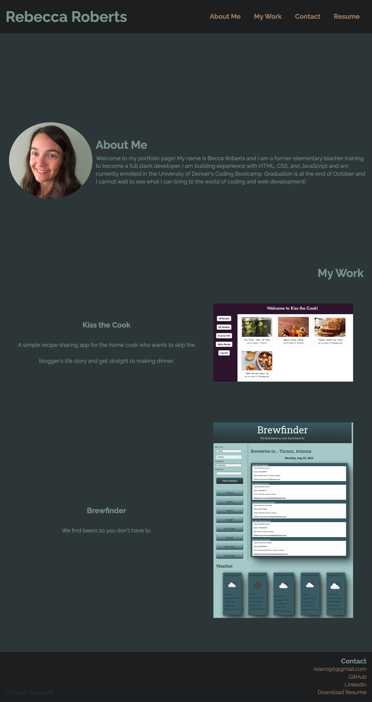

# professional-portfolio

## About

This is a web application to display my growing professional portfolio as a full-stack web developer. It includes a short bio, links to work samples (updated as I complete them), contact information, and a link to my resume. CSS styling is responsive to viewport size.

## Appearance

## Deployed Application Link

https://relero90.github.io/rroberts-professional-portfolio/
